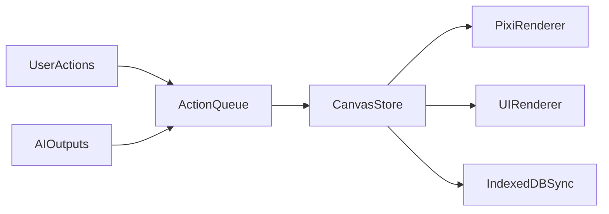

# AI 友好画布工具 - 项目文档

本文档聚焦前端实现，覆盖项目架构、功能规划与技术实现方案，支持后续扩展协作与 AI 能力。

## 项目架构

### 架构目标
- 可视化画布 + 结构化数据，支持 AI 可读可写
- 前端可独立运行，支持离线与本地存储
- 渲染与数据解耦，便于性能优化与功能扩展

### 分层结构
1. CanvasEngine（PixiJS）
   - 画布渲染、交互事件、选中与框选
   - 多图层管理（nodes / edges / selection / overlay）
2. StateData（Zustand）
   - 画布数据（nodes / edges / groups）
   - 历史记录（undo/redo）
   - AI actions 批量执行
3. UI（React + shadcn/ui）
   - 工具栏、属性面板、AI 面板
   - 状态驱动视图更新
4. Persistence（IndexedDB）
   - 画布数据与历史的离线持久化
   - 版本恢复与自动保存

### 前端数据流（概览）



### 项目结构目录规划

目录规划与模块分层一一对应，便于渲染、状态、UI 与持久化解耦。

```
src/
  app/                # 应用启动与全局初始化
  engine/             # CanvasEngine（PixiJS）
    layers/           # nodes/edges/selection/overlay 图层
    events/           # 交互事件与命中测试
    renderer/         # 渲染流程与优化
  store/              # StateData（Zustand）
    slices/           # nodes/edges/groups 等分片
    history/          # undo/redo 与命令栈
  ui/                 # UI（React + shadcn/ui）
    components/       # 通用组件
    toolbar/          # 工具栏
    panels/           # 属性面板 / AI 面板
    hooks/            # UI 侧自定义 hooks
  ai/                 # AI actions 解析/校验/执行
  persistence/        # IndexedDB 同步与恢复
  types/              # 共享类型定义
  utils/              # 通用工具
```

## 功能规划

### V0.1（MVP）
- 基础画布：节点与连线、拖拽缩放、多选/框选
- 结构化数据：节点/边/分组模型
- AI 指令执行：前端接收 actions 并批量执行
- 本地存储：IndexedDB 自动保存与恢复

### V0.2
- 撤销/重做与版本历史
- 分组与布局操作（对齐/分布）
- MiniMap 与画布导航

### V0.3
- AI 自动结构化（文本 -> 画布）
- AI 画布重构（分组、排序、布局优化）
- 大规模节点性能优化（虚拟渲染/分区渲染）

## 技术实现

### 技术栈
- React + TypeScript
- PixiJS（高性能渲染）
- Zustand（状态管理）
- shadcn/ui（UI 组件）
- IndexedDB（离线持久化）

### 核心模块设计

1. CanvasEngine（PixiJS）
   - Layer 管理：nodes / edges / selection / overlay
   - 交互：拖拽、缩放、框选、对齐
   - 渲染优化：可视区域渲染、批量更新

2. StateData（Zustand）
   - 统一管理画布状态：nodes / edges / groups / selection
   - AI action 执行：addNode / updateNode / addEdge 等
   - 历史记录：undo/redo（命令栈）

3. UI（React + shadcn/ui）
   - Toolbar：节点、连线、分组、对齐
   - SidePanel：属性编辑、节点内容编辑
   - AIPanel：指令输入与执行

4. Persistence（IndexedDB）
   - 自动保存：操作后节流写入
   - 版本记录：保存最近 N 次历史
   - 恢复策略：启动时自动加载最后画布

### AI 指令执行（前端）
- 输入：结构化 actions（JSON）
- 校验：字段与类型校验（只允许白名单操作）
- 执行：批量执行后触发一次渲染

### 性能策略
- 可视区域渲染（虚拟化）
- 批量更新与 requestAnimationFrame 渲染
- 渲染层分离，减少重绘范围
- 大画布分区加载（后续版本）

