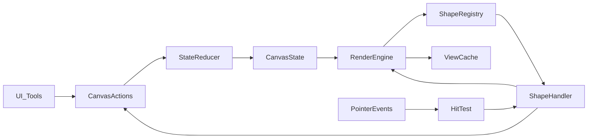

# 图形设计架构

本文档描述基于“集中 JSON state”的图形系统长期架构，目标是让图形具备统一的数据模型、可插拔的渲染/交互行为，以及稳定的序列化/迁移能力。

## 目标与原则
- 单一状态源：图形状态仅存在于 JSON state。
- 渲染无业务状态：渲染层只消费 state，不持久化业务状态。
- 交互动作化：交互产生 actions，统一进入 reducer/历史/协作管线。
- 可扩展：新增图形只需注册 handler，不改核心引擎。
- 可回放/可协作：actions 可重放、可审计、可合并。

## 核心概念

### Shape 类型体系
图形分为“统一基类 + 类型/形态参数”。例如 rect/ellipse 通过 `type = "geometry"` 与 `kind` 区分。

```ts
export type BaseShape = {
  id: string;
  type: string;
  position: { x: number; y: number };
  size: { width: number; height: number };
  rotation?: number;
  style?: StyleProps;
  data?: Record<string, unknown>;
  meta?: {
    locked?: boolean;
    hidden?: boolean;
    createdAt?: number;
    updatedAt?: number;
  };
};

export type GeometryShape = BaseShape & {
  type: "geometry";
  kind: "rect" | "ellipse";
  style?: StyleProps & { cornerRadius?: number };
};
```

### 统一样式模型
```ts
export type StyleProps = {
  stroke?: string;
  strokeWidth?: number;
  fill?: string;
  opacity?: number;
  dash?: number[];
  cornerRadius?: number;
  fontSize?: number;
  fontFamily?: string;
  textAlign?: "left" | "center" | "right";
};
```

### 交互能力标签（Traits）
图形声明能力，交互层复用行为实现。

```ts
export type Traits = {
  draggable?: boolean;
  resizable?: boolean;
  rotatable?: boolean;
  connectable?: boolean;
  textEditable?: boolean;
};
```

## Shape Registry 与 Handler

### Handler 接口
```ts
export type ShapeHandler = {
  render: (shape: BaseShape, ctx: RenderContext) => void;
  hitTest: (shape: BaseShape, point: Point) => boolean;
  getBounds: (shape: BaseShape) => Rect;
  getAnchors?: (shape: BaseShape) => Anchor[];
  getSnapPoints?: (shape: BaseShape) => Point[];
  onPointerDown?: (shape: BaseShape, ctx: InteractionContext) => CanvasAction[];
  onPointerMove?: (shape: BaseShape, ctx: InteractionContext) => CanvasAction[];
  onPointerUp?: (shape: BaseShape, ctx: InteractionContext) => CanvasAction[];
  traits?: Traits;
};
```

### Registry
```ts
export const shapeRegistry: Record<string, ShapeHandler> = {
  geometry: GeometryShapeHandler,
  text: TextShapeHandler,
  arrow: ArrowShapeHandler
};
```

### 当前实现对齐（代码）
目前代码已落地 registry 的最小结构，位置如下：
- `src/shapes/types.ts`: BaseShape/GeometryShape/TextShape/StyleProps/Traits
- `src/shapes/geometry.ts`: geometry handler（rect/ellipse，Pixi render）
- `src/shapes/text.ts`: text handler（Pixi render）
- `src/shapes/registry.ts`: registry 注册与查询
- `src/engine/renderer/PixiRenderer.ts`: 通过 registry 调用 handler.render

## 渲染架构

### RenderContext
```ts
export type RenderContext = {
  stage: unknown;
  layers: {
    nodes: unknown;
    edges: unknown;
    overlay: unknown;
  };
  viewCache: Map<string, unknown>;
};
```

### 渲染流程
1. 读取 `CanvasState` 中的 shapes。
2. 查找 shape 的 handler。
3. `handler.render(shape, ctx)` 绘制。
4. viewCache 进行增量更新（只更新 dirty shapes）。

当前渲染落地：`PixiRenderer` 在 `renderNodes` 中使用 registry 调用 `handler.render`，并将结果写入 `viewCache`。

## 交互与事件流
- 引擎接收 pointer 事件。
- 命中测试：`handler.hitTest`。
- 交互处理：`handler.onPointerDown/Move/Up`。
- handler 返回 actions。
- reducer 更新 state。
- 渲染引擎消费新 state。

## UI 接入约定
- 工具栏通过 store actions 创建图形，例如 `addGeometry("rect")`、`addGeometry("ellipse")`、`addText("文本")`。
- UI 只负责发出 actions，不直接操作渲染层或 view。

## 图形移动（拖拽）设计

### 目标与范围
- 支持单选拖拽与多选整体拖拽。
- 拖拽过程只通过 actions 更新 state，不直接修改 view。
- 以节点移动为主，edge/group 后续扩展。

### 运行时交互状态（非持久）
```ts
type DragSession = {
  active: boolean;
  mode: "single" | "multi";
  start: { x: number; y: number };
  basePositions: Record<string, { x: number; y: number }>;
};
```

### 交互流程
- pointerDown：若点击已选中节点，进入拖拽；若点击未选中节点，先选中再进入拖拽。
- pointerMove：计算偏移量 `dx/dy`，批量更新 selection 中节点的位置。
- pointerUp：结束拖拽，清理 DragSession。

### Actions 设计
```ts
type DragActions =
  | { type: "node.position.batch"; payload: Array<{ id: string; x: number; y: number }> };
```

### 约束与扩展点
- `meta.locked` 节点不可拖拽。
- 吸附/对齐：在 move 阶段基于 snap points 修正 `dx/dy`。
- 性能优化：只更新 dirty nodes，拖拽过程中节流渲染。

### 渲染反馈
- 选中高亮保持显示。
- 可选：拖拽时展示 ghost 预览。

## 序列化与版本迁移
- 所有 shapes 必须可序列化为 JSON。
- 每个 shape 可维护 `schemaVersion`。
- 迁移器根据版本升级旧数据。

## 扩展机制
- 新增 shape：新增 handler 并注册到 registry。
- 新增 tool：实现 Tool handler，产出 actions。
- 新增 renderer：实现 RenderContext 与渲染适配。

## Mermaid 架构图



## 设计要点总结
- 数据与行为分离：数据在 state，行为在 handler。
- 统一几何图形：rect/ellipse 作为 GeometryShape 的 kind。
- 可插拔：handler 允许按类型独立扩展。
